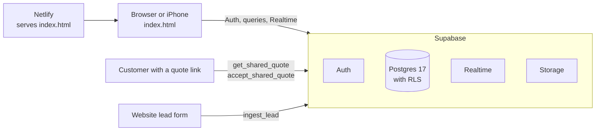

# DeckOps

DeckOps, which I call "the Deck", is the operations app I use to run AnchorPoint IT and Installations LLC, my one-person IT and installation business. It handles customers, jobs, scheduling, estimates, parts, invoices, sales tax, referrals, and quote links I can text to a customer.

It is live and I use it every day.

## Why I built it

Most field service CRMs are priced and designed for companies with fleets of technicians. I needed quoting, scheduling and invoicing for one person, and it had to work on my phone in a basement with no signal.

## How it was built

I built DeckOps using AI tools. Claude, Anthropic's AI, wrote the code. I handled the direction and the testing: the product and architecture decisions, what each role is allowed to see and do, reviewing changes, catching bugs, and testing on my iPhone.

## Architecture

- **Frontend.** One `index.html`, vanilla JavaScript, no build step. I deploy it to Netlify by drag and drop.
- **Backend.** Supabase: Postgres 17 with row level security, Auth for sign-in, Realtime for live updates, Storage for job photos.
- **Offline.** The app keeps a local copy of the data in the browser. A write made offline, or one that fails, goes into an outbox queue in `localStorage`. The queue retries every 20 seconds and replays as soon as the browser is back online.
- **Sync.** A Realtime subscription on `customers`, `jobs`, `parts` and `settings` triggers a refresh when another device changes something. A background pull every 90 seconds is the fallback in case Realtime stops delivering.
- **Photos.** Before and after photos are resized to 1600 px and compressed in the browser before upload. They are stored in a Storage bucket and loaded through signed URLs that expire after an hour.
- **Quote links.** A link like `?q=<token>` opens a public quote page instead of the app. The customer sees the line items, discount, tax and total, and can accept by typing their name. Accepting tells me to go ahead. It is not a signature or a contract.

## Known limitations

- **The erase password is a speed bump.** It is stored as a salted PBKDF2-SHA256 hash with 310,000 iterations, but it is checked in the app, not in the database.
- **Row ids come from the browser**, built from a timestamp plus `Math.random()`. That works for one business, but I'd switch to database-generated ids before anything multi-user.
- **No Content Security Policy yet.** supabase-js is pinned to an exact version (`2.111.0`) because ES module imports can't use Subresource Integrity, so a floating version would run whatever the CDN serves.
- **The app is one large file on purpose**, because I deploy it by drag and drop.

## What I'd do next

- A written contract generator for accepted quotes.
- Deposits tracked in their own column.
- A Content Security Policy.

## License

MIT
